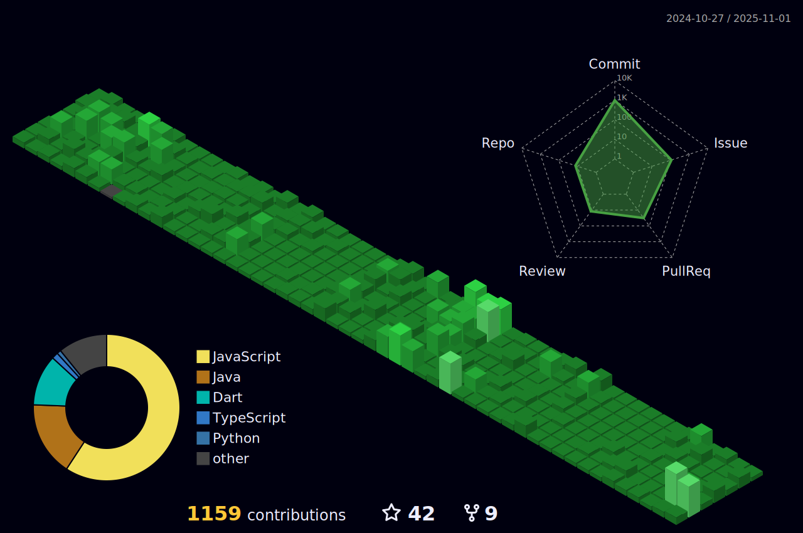

  

  <!--  -->

  
   

  
<strong>🌐 주요 대외활동</strong>

   
  아마존 워킹백워드 워크샵 & 기업탐방(2025, AWS) 
  SW중심대학협의회 SW인재페스티벌 참가(2025, 서울드래곤시티) 
  SW중심대학 우수작품 경진대회 참가(2025) 
  SW중심대학 디지털 경진대회 참가(2025) 
  한국디지털콘텐츠학회 하계종합학술대회 대학생 논문경진대회 참가(2025) 
  선문대학교 SW 중심대학사업단 기업연계 프로젝트 우수팀 경진대회 참가(2025) 
  선문 창업 IDEA 경진대회 참가(2025) 
  제 8회 대학생 창의력 경진대회 참가(2025) 
  몰입형 SW학기제 정규 교육과정 프로젝트 경진대회 참가(2024) 
  Microsoft 천하제일 입코딩 대회 참가(2025) 
  2025 SUMTECH Hackathon 참가(한양대학교 ERICA) 
  괌 SW 단기 연수 해커톤 경진대회 참가(2025, 울산대학교 SW 중심대학사업단) 
  제2회 GenAI 해커톤 참가(2024, Primer) 
  ICT융합 해커톤 참가(2021, 선문대학교 공학교육혁신센터) 
  천안교육청 AI/SW대학연계 늘봄 사업: 천안 신용초등학교 주강사(2025) 
  AI/SW 창업동아리 활동(선문대학교 SW중심대학사업단, 2025) 
  클라우드 컴퓨팅(Azure) 교과목 멘토 활동(2025) 
  인공지능 끝장 로봇 개발 한마당 AI·SW 서포터즈 활동(2024) 
  충남 AI·SW 학생 동아리 한마당 행사 멘토링 활동(2023) 
  괌 단기연수(IT·데이터 분석 분야, 2025)

  
<strong>📖 교육 이수</strong>

   

  <strong>AWS Technical Essentials 수료 (2025, AWS)</strong> 
  EC2, VPC, S3, EBS 등 AWS 핵심 서비스 및 IAM 보안, RDS/DynamoDB, CloudWatch 모니터링 
  
  <strong>Architecting on AWS 수료 (2025, AWS)</strong> 
  AWS Well-Architected Framework 기반 클라우드 아키텍처 설계 및 구축 
  
  <strong>Generative AI Essentials 수료 (2025, AWS)</strong> 
  Amazon Bedrock 기반 생성형 AI 모델 활용 및 프롬프트 엔지니어링 
  
  <strong>AWS Agentic AI Foundation 수료 (2025, AWS)</strong> 
  Amazon Bedrock Agents를 활용한 AI 에이전트 구축 및 워크플로우 설계 
  
  <strong>몰입형 SW학기제 정규 교육과정 이수 (2024, 선문대학교 SW중심대학사업단)</strong> 
  Java·Spring Boot·MySQL 기반 백엔드 개발 및 Naver Cloud Platform 배포 과정 수료 
  
  <strong>심화_생성형 AI 개발자 부트캠프 이수 (2024, 애드인에듀)</strong> 
  Python 딥러닝 모델링 및 FastAPI 기반 모델 서빙을 통한 고성능 AI 서비스 구축 역량 교육 이수 
  
  <strong>Unity 게임 프로그래밍 이수 (2021, 선문대학교 SW융합교육원)</strong> 
  Unity·C# 기반의 게임 핵심 기능 구현 및 플레이 가능한 프로토타입 개발 프로젝트 수행 

  
<strong>🏅 수상 경력</strong>

   

  2025 SW중심대학 우수작품경진대회 후원기업상 / SW중심대학협의회 
  2025 기업연계 프로젝트 우수팀 경진대회 대상 / 선문대학교 SW 중심대학사업단 
  2025 하계종합학술대회 대학생 논문경진대회 대상 / 한국디지털콘텐츠학회 
  2025 선문 창업 IDEA 경진대회 최우수상 / 선문대학교 SW 중심대학사업단 
  2025 SUMTECH Hackathon 우수상 / 한국디지털콘텐츠학회 
  2025 괌 SW 단기 연수 해커톤 경진대회 우수상 / 울산대학교 SW 중심대학사업단 
  2025 제 8회 대학생 창의력 경진대회 우수상 /한국창의력교육학회 
  2024 몰입형 SW학기제 정규 교육과정 프로젝트 경진대회 우수상 / 선문대학교 SW중심대학사업단 
  2021 ICT융합 해커톤 금상 / 선문대학교 공학교육혁신센터

  
### Certificate

### Links

 

